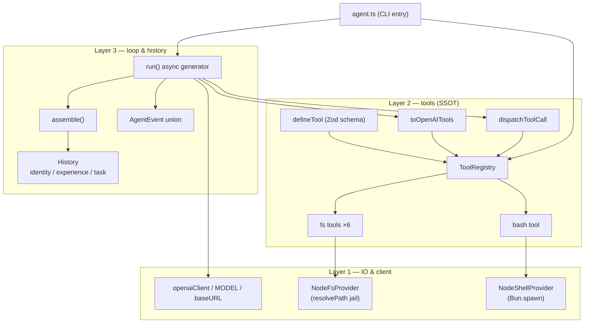
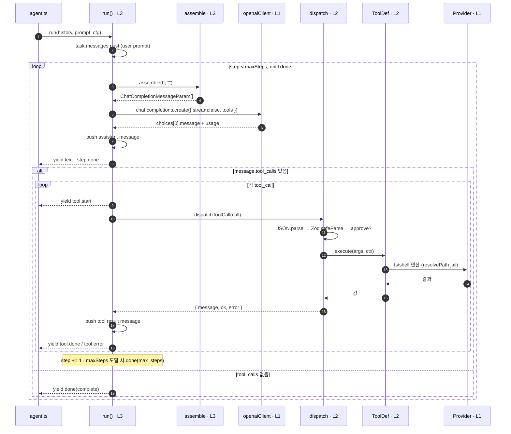
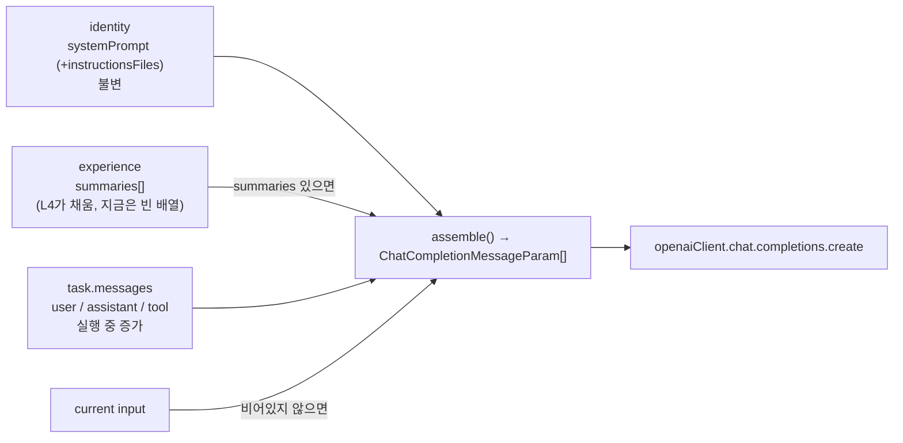
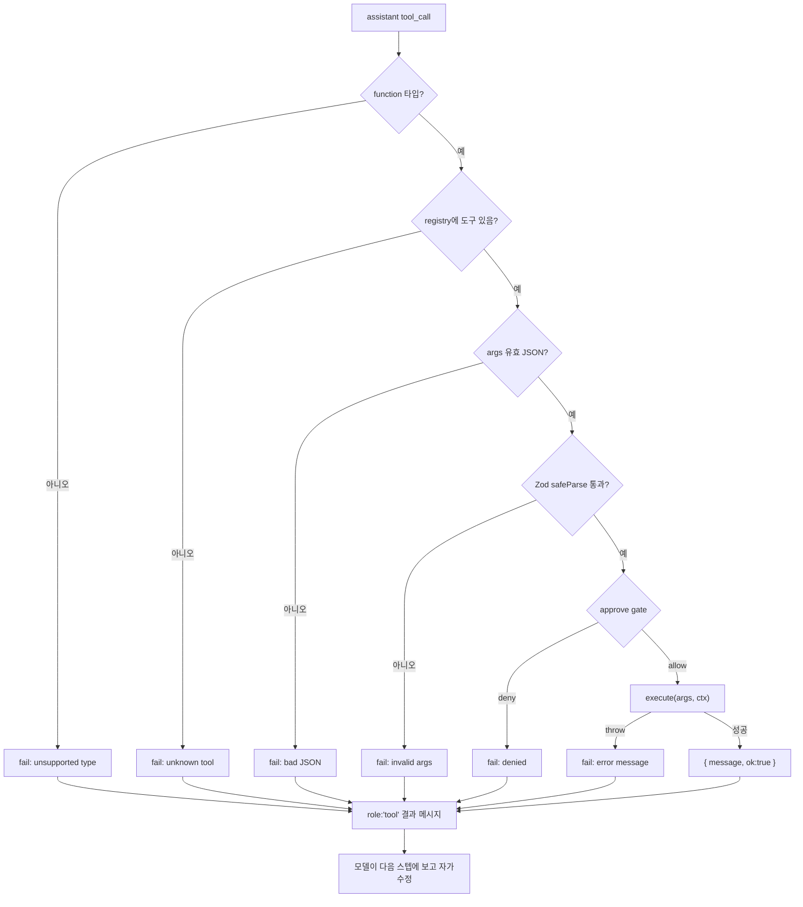

# Agent Harness — Layer 1~3 동작 설명

현재 구성: **non-streaming**, L1~L3만 연결. L4(compaction)·L5(subagent)는 파일은
있으나 미연결.

```
L1  client + IO providers   단일 OpenAI 호환 클라이언트 + fs/shell 프로바이더
L2  tool SSOT + dispatcher   Zod 스키마 1개 = JSON 도구 + 인자 타입 + 런타임 검증
L3  stateless loop + history  3블록 히스토리 + assemble + run() 제너레이터
```

핵심 원칙: **의존성은 아래로만**(L3→L2→L1). 위로 새지 않음. 루프는 상태 없음
(stateless) — 호출자가 `History`를 넣고, `done` 이벤트로 갱신된 `History`를 돌려받음.

---

## 1. 레이어 / 모듈 의존도



- **L1** — LLM env를 만지는 유일한 곳(`client.ts`). 파일/셸은 좁은 인터페이스
  (`FsProvider`/`ShellProvider`) 뒤에 둠 → 백엔드 교체 가능, `resolvePath`가 샌드박스
  단일 관문.
- **L2** — `defineTool(Zod)` 하나가 세 얼굴: ① 모델이 보는 JSON(`toOpenAITools`),
  ② execute 인자 타입(`z.infer`), ③ 런타임 검증(`safeParse`).
- **L3** — `run()`이 모든 걸 조율. `History` 3블록을 `assemble()`로 평탄화해서 API에
  보냄.

---

## 2. `run()` 한 번 호출의 실행 흐름 (시퀀스)



요점:
- **non-streaming** — `create({stream:false})`로 응답 전체(텍스트+tool_calls+usage)가
  한 번에 옴. 조각 재조립 없음. 그래서 루프가 평범한 async generator.
- 도구는 **순차** 실행. 루프가 `dispatchToolCall` 앞뒤로 직접 이벤트 yield(이벤트 큐
  불필요).
- 종료 조건 3가지: `complete`(도구 호출 없음) / `max_steps` / `stopped`(signal) /
  `error`(catch).

---

## 3. 3블록 히스토리 → `assemble()` 데이터 플로우



- 히스토리는 평평한 채팅 로그가 **아님** — 의미 단위 3블록.
  - `identity`: 정체성(시스템 프롬프트). 한 번 set, 불변.
  - `experience`: 증류된 장기 기억. L4 compaction이 채움(현재 미연결 → 항상 비어있음).
  - `task`: 살아있는 작업 메시지. 매 스텝 늘어남.
- `assemble()`는 매 스텝 이 3블록을 **그때그때** 평탄화. 평평한 배열은 transient,
  보존되는 단위는 항상 `History`.
- `run()`은 입력을 미리 `task.messages`에 push하므로 `assemble(h, "")`로 호출(input
  빈 문자열).

---

## 4. 디스패치 — "에러를 도구 결과로" (errors-as-tool-results)



- 검증 실패·거부·throw **전부** `role:"tool"` 결과 문자열로 렌더링 → 루프는 절대 안
  죽음. 모델이 실패를 보고 다음 스텝에 스스로 고침.
- `dispatchToolCall`은 **순수 함수**: 이벤트 발생도, 동시성 슬롯도 없음. 결과는
  `{ message, ok, error }`. 루프가 `ok` 보고 `tool.done`/`tool.error` 결정.

---

## 5. AgentEvent — 레이어가 yield하는 이벤트

| 이벤트 | 의미 |
|---|---|
| `text` | assistant 텍스트 (non-streaming이라 한 번에 전체) |
| `tool.start` / `tool.done` / `tool.error` | 도구 호출 생애주기 |
| `step.start` / `step.done` | 스텝 경계 + 토큰(`lastInput/OutputTokens`) |
| `error` | 루프 catch가 잡은 예외 |
| `done` | 종료 — `result`(complete/stopped/max_steps/error), 갱신된 `history`, `totalUsage`(in/out/total) |

`agent.ts`의 `render()`가 이 이벤트들을 받아 터미널에 출력(텍스트=stdout, 메타=stderr,
TTY일 때 색).

---

## 파일 지도

| 경로 | 역할 |
|---|---|
| `layer1/client.ts` | openaiClient·MODEL·baseURL (LLM env 유일 관문) |
| `layer1/providers/types.ts` | `FsProvider`/`ShellProvider` 인터페이스 |
| `layer1/providers/node-fs.provider.ts` | Bun fs + `resolvePath` 샌드박스 |
| `layer1/providers/node-shell.provider.ts` | `Bun.spawn` 셸 (timeout·truncate) |
| `layer2/tool.ts` | `defineTool`·`ToolDef`·`toOpenAITools` (Zod SSOT) |
| `layer2/dispatch.ts` | `dispatchToolCall` (검증→승인→실행, 순수) |
| `layer2/tools/fs.tools.ts` | readFile·writeFile·editFile·listFiles·grep·deleteFile |
| `layer2/tools/shell.tools.ts` | bash |
| `layer3/blocks.ts` | `History` 3블록 + `assemble` + `emptyHistory` |
| `layer3/events.ts` | `AgentEvent` union |
| `layer3/loop.ts` | `run()` — stateless async generator |
| `agent.ts` | CLI entry — 배선 + `render` |
| `utils.ts` | 공용 CLI 헬퍼 (색·stdout writer) |
```
